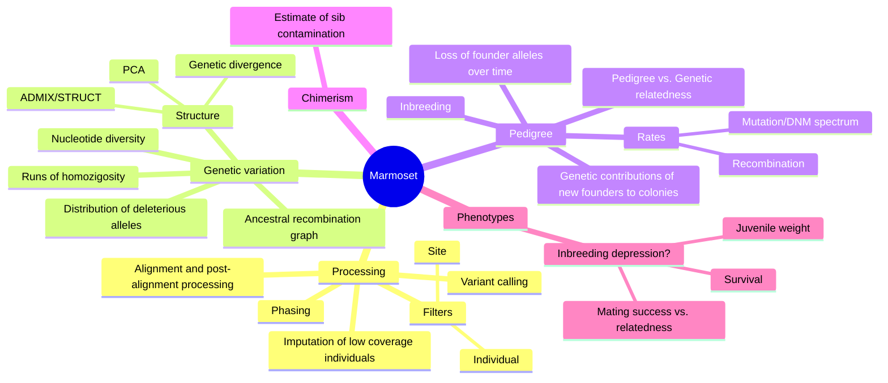

## Analysis
### Genetic variation
- Nucleotide diversity
	- [ ] Need callable mask
- Distribution of deleterious alleles (and comparison to founders/natural population)
- Runs of homozigosity
- Structure
	- PCA
	- Genetic divergence
	- ADMIXTURE (unsupervised) and STRUCTURE
- Ancestral recombination graph (SINGER)
### Pedigree
- Inbreeding
- Loss of founder alleles over time
- New introductions (beyond the founders)?
	- How do these contribute to the genetic composition of colonies
- Pedigree vs. Genetic relatedness
	- Errors in pedigree
- Rates
	- Mutation and spectrum of DNMs
	- Recombination
### Phenotype
- Signs of inbreeding depression?
	- Infant mortality
	- Juvenile weight
	- Mating success and how it relates to relatedness (IBD or pedigree-based)

## Data processing
Recommendations from Lucie Bergeron's paper
- Genome assembly:
	-  Potentially better assembly with the Vertebrate Genome Project (39k scaffolds [old](https://www.ebi.ac.uk/ena/browser/view/GCA_002754865.1) vs. 1230 scaffolds [new](https://www.genomeark.org/genomeark-all/Callithrix_jacchus.html))
- Alignment and post-alignment processing
	- Trimming of adaptors and low quality reads (SOAPnuke)
	- Mapping (bwa-mem)
	- Remove duplicates (Picard)
	- Remove reads mapping to multiple locations (samtools)
- Variant calling
	- GATK
	- Mode:
		- HaplotypeCaller in bp resolution per individual
		- Combine individuals with CombineGVCF, 
		- Joint genotyping with GenotypeGVCF
	- Site filters
		- QD<2.0
		- FS>20
		- MQ<40
		- -2.0<MQRankSum<4.0
		- -3.0<ReadPosRankSum<3.0
		- SOR>3.0
		- Variants within homopolymers AAAAAAAAAA or TTTTTTTTTT
	- Individual filters
		- Mendelian violation
		- 0.3<AB<0.7
		- 0.5 depth individual < DP < 2 depth individual
		- GQ > 20
- Phasing
## Bibliography
### Inspiration
- [ ] [Variation in mutation, recombination, and transposition rates in _Drosophila melanogaster_ and _Drosophila simulans_](https://genome.cshlp.org/content/33/4/587.short
- [ ] [The germline mutational process in rhesus macaque and its implications for phylogenetic dating](https://pubmed.ncbi.nlm.nih.gov/33954793/)
- [ ] [The Mutationathon highlights the importance of reaching standardization in estimates of pedigree-based germline mutation rates](https://elifesciences.org/articles/73577#fig3)
- [ ] [The relevance of pedigrees in the conservation genomics era](https://www.ncbi.nlm.nih.gov/pmc/articles/PMC9298073/)
- [ ] [Comparison and assessment of family- and population-based genotype imputation methods in large pedigrees](https://www.ncbi.nlm.nih.gov/pmc/articles/PMC6314157/)
- [ ] [Genomic Underpinnings of Population Persistence in Isle Royale Moose](https://academic.oup.com/mbe/article/40/2/msad021/7024794)
### Methods
- [ ] IBIS - IBD stretch inference from unphased data - [Rapid, Phase-free Detection of Long Identityby-Descent Segments Enables Effective Relationship Classification](https://www.cell.com/ajhg/pdf/S0002-9297(20)30054-9.pdf)
- [ ] KING [Robust relationship inference in genome-wide association studies](https://academic.oup.com/bioinformatics/article/26/22/2867/228512)
- [ ] Pedigree error detection and correction PREST - [Enhanced pedigree error detection](https://pubmed.ncbi.nlm.nih.gov/12566741/)
- [ ] Phasing with pedigrees PULSAR - [Genotype phasing in pedigrees using whole-genome sequence data](https://www.nature.com/articles/s41431-020-0574-3#Sec13)
- [ ] 
- [ ] SHAPEIT5 (also takes duos/trios) [Accurate rare variant phasing of whole-genome and whole-exome sequencing data in the UK Biobank](https://www.nature.com/articles/s41588-023-01415-w)